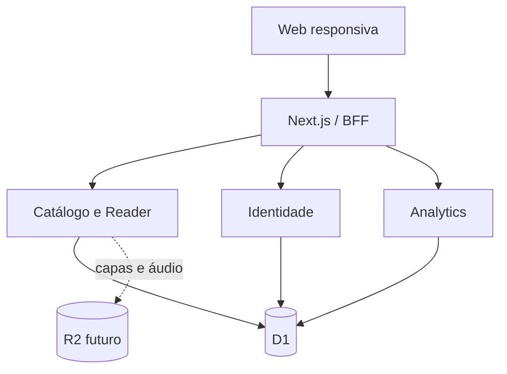

# Arquitetura — Sambu Online

O MVP usa um monólito modular em Next.js/Vinext, com renderização no servidor e componentes interativos no cliente. O banco D1 mantém dados relacionais e progresso; mídia futura será isolada em R2. A autenticação usa a identidade segura do ambiente ChatGPT, sem senhas próprias no MVP.

Decisões: monólito modular primeiro; progresso vinculado à identidade e validado no servidor; dados fictícios de demonstração; preferências visuais locais e progresso persistente; sem segredos no cliente.
